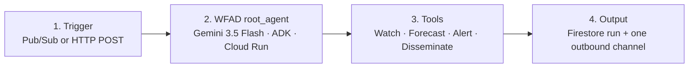

# WFAD architecture

One root agent. Four tools. Four boxes. Not a five-agent fleet.

Gemini 3.5 Flash is the contest LLM. This repo is authored in a coding assistant; that assistant is not in the runtime.

| Box | What it is | What it is not |
| --- | --- | --- |
| Trigger | Pub/Sub topic `wfad-triggers`, Cloud Scheduler, or `POST /trigger` | A human clicking through a dashboard |
| root_agent | `wfad/agent.py` → `root_agent`, model `gemini-3.5-flash` | Grok, a multi-agent crew, Agent Gateway |
| Tools | Thin NWS Watch, briefing formatter, rule-table Alert, Disseminate | The Doc dashboard or the Leesa UI |
| Output | Firestore `wfad_runs` plus one email (or a labeled stub until Wednesday) | Railway, Vercel, or this sandbox as hosting |

## Loop

1. **Watch** — `watch_conditions` hits `api.weather.gov` (points, active alerts, latest station observation, four forecast periods).
2. **Forecast** — `write_briefing` formats an on-air script and a social blurb from that payload only.
3. **Alert** — `decide_alert` assigns ROUTINE / MODERATE / HIGH / CRITICAL and a recipient list. Rules are deterministic.
4. **Disseminate** — `disseminate_package` writes Firestore via `record_run` and sends email (SMTP when configured; otherwise a labeled fake send).

Background proof: `POST /trigger` with `{"location":"Rochester, NY","reason":"scheduled_briefing"}`. Same handler accepts a Pub/Sub push envelope.
